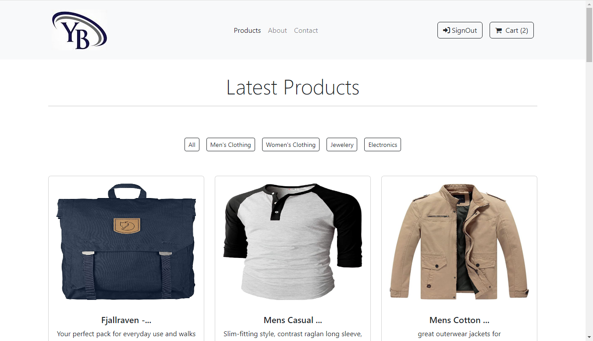
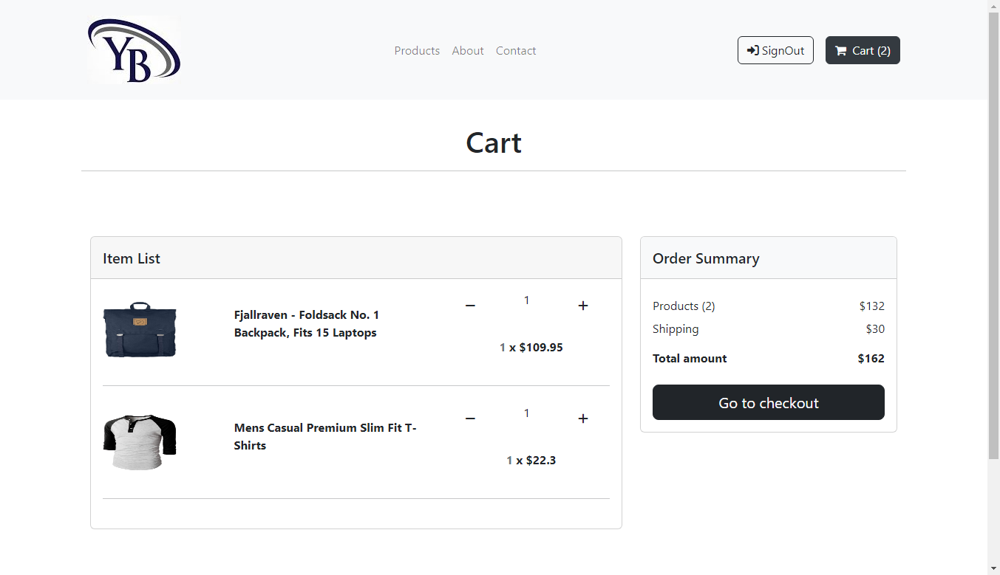

# E-Commerce Website

A Ecommerce Website made with React.js Framework.


## Demo

https://yb-shopping.netlify.app/

## Features

- Easy to integrate with Backend
- Fully Responsive


## Screenshots




## Run Locally

Clone the project

```bash
  git clone https://github.com/Yeabtsega1/Shopping site
```

Go to the project directory

```bash
  cd Shopping site
```

Install dependencies

```bash
  npm install
```

Start the server

```bash
  npm start
```


## Tech Stack

* [React](https://reactjs.org/)
* [Redux](https://redux.js.org/)
* [Bootstrap](https://getbootstrap.com/)
* [Fake Store API](https://fakestoreapi.com/)

## Contributing

Contributions are always welcome!
Just raise an issue, we will discuss it.


## Feedback

If you have any feedback, please reach out to me [here](https://yeab-portfolio.netlify.app/#contact)


